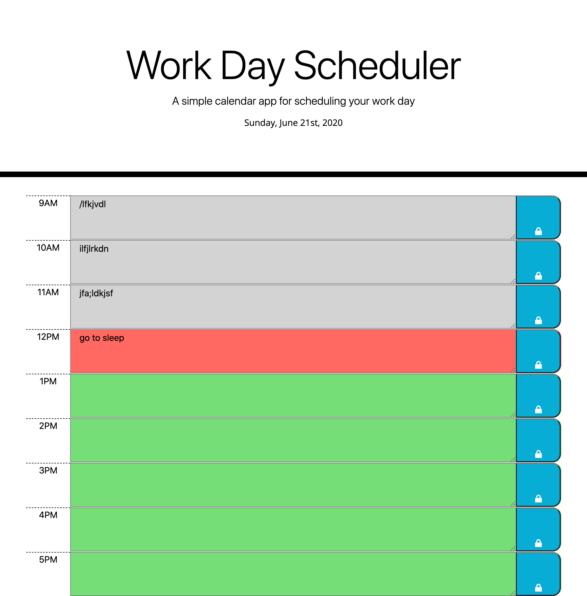

# Work Day Scheduler Starter Code

This application will allow the user to have a daily planner. 
It has the current date at the top of the website. 
As the day goes on the background of the text will change based on the hour. Past hours will be gray, the current hour will be red, future hours will be green. It saves inputed text into the local storage so that when the user refreshes the page it will still be visible. 

[link to my website](https://ryannekillian.github.io/daily-planner/)

